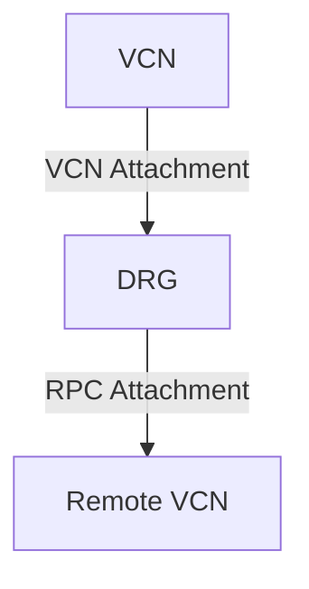

# 🚦 Dynamic Routing Gateway (DRG) Basics

## 🏗️ What is DRG?
- DRG = **Dynamic Routing Gateway**  
- Functions as a **virtual router** in OCI.  
- Can have multiple **attachments**:

### 🔗 Types of Attachments
1. **VCN Attachment** – attaches a Virtual Cloud Network.  
2. **Remote Peering Connection (RPC)** – enables private VCN-to-VCN communication across regions.  
3. **IPsec Tunnel** – used in **Site-to-Site VPN** connections.  
4. **Virtual Circuit** – used in **FastConnect** connections.  
5. **Loopback Attachment** – allows traffic forwarding between attachments inside the same DRG (e.g., Virtual Circuit → IPsec Tunnel).  

---

## 🛤️ Routing in DRG
Routing in DRG is controlled by two main entities:
1. **DRG Route Tables**  
2. **DRG Route Distributions**  

---

## 📑 DRG Route Tables
When you create a DRG, **two route tables** are automatically created:

1. **Autogenerated DRG Route Table for RPC, Virtual Circuit, and IPsec Attachments**  
2. **Autogenerated DRG Route Table for VCN Attachments**  

---

## 🔄 DRG Route Distributions
There are **two types**:
- **Import Route Distribution** (controls which routes are imported into a route table)  
- **Export Route Distribution** (controls which routes are exported from a route table)  

When a DRG is created:  
- ✅ **2 Import Route Distributions** are autogenerated:
  - Import Route Distribution for **All Routes**  
  - Import Route Distribution for **VCN Routes**  
- ✅ **1 Export Route Distribution** is autogenerated:
  - Default Export Route Distribution for DRG  

---

## 🧩 How They Work Together
- **Route Table for RPC/Virtual Circuit/IPsec** → uses **Import Route Distribution for VCN routes**  
- **Route Table for VCN Attachments** → uses **Import Route Distribution for all routes**  

---

## 🖼️ Example
Consider this setup:  

- **Route Table for RPC/VC/IPsec Attachments**  
  - Imports only **VCN routes** → contains a **dynamic route for the VCN**.  

- **Route Table for VCN Attachments**  
  - Imports **all routes** → contains routes for:  
    - VCN  
    - Remote Peering Connection  

---

## ✅ Key Takeaways
- **DRG = virtual router** that connects VCNs, VPNs, RPCs, and FastConnect.  
- **Multiple attachments** are possible, including loopback.  
- **Two route tables** are autogenerated: one for VCNs, one for all others.  
- **Route distributions (import/export)** decide which routes go where.  
- By default:  
  - RPC/VC/IPsec tables import **VCN routes only**  
  - VCN route table imports **all routes**  

