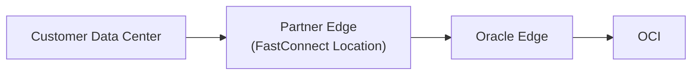
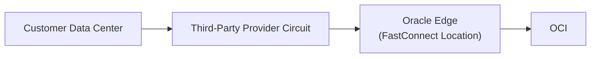
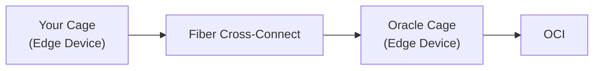

# Lesson: OCI FastConnect Connectivity Models

## 🔹 Connectivity Models Overview
There are **three main models**:

1. **FastConnect with an Oracle Partner**  
2. **FastConnect with a Third-Party Provider**  
3. **FastConnect Colocation with Oracle**

> 📌 In the OCI Console, you will see two options when creating FastConnect:  
> - **Oracle Partner**  
> - **FastConnect Direct** → includes **Third-Party Provider** and **Colocation**.

---

## 1️⃣ FastConnect with an Oracle Partner
- **Setup:**
  - Your **Customer Data Center (CPE)** connects to a **partner edge** already integrated in the FastConnect location.
  - The **partner** has an existing connection to Oracle’s FastConnect edge.

- **Key Points:**
  - ✅ **No Letter of Authorization (LOA)** required.  
  - ✅ You only provision a connection between your data center and the **partner’s network**.  
  - ✅ Oracle Partner already maintains connectivity with Oracle.

**Architecture Flow:**

---

## 2️⃣ FastConnect with a Third-Party Provider
- **Setup:**
  - You choose a **network carrier** (not an Oracle partner).  
  - The carrier provides a **dedicated private circuit** from your on-premises environment to the **Oracle FastConnect edge**.

- **Key Points:**
  - ✅ **LOA required**. Oracle issues a Letter of Authorization.  
  - ✅ You forward the LOA to your **third-party provider**, who then provisions the **cross-connect**.  
  - ❌ Unlike Oracle partners, these providers are **not pre-integrated**.

**Architecture Flow:**

---

## 3️⃣ FastConnect Colocation with Oracle
- **Setup:**
  - You already have a **cage and edge devices** inside the **same FastConnect location** as Oracle.  
  - Both your equipment and Oracle’s equipment reside within the facility.

- **Key Points:**
  - ✅ **LOA required** (but provided to the **data center technician**, not a provider).  
  - ✅ A **direct fiber cross-connect** is established **between your cage and Oracle’s cage**.  
  - ✅ No external carriers are involved since you are already colocated.

**Architecture Flow:**

---

## ✅ Summary
- **Partner Model** → Simplest, no LOA required, partner already integrated.  
- **Third-Party Provider Model** → Requires LOA, carrier provisions the physical circuit.  
- **Colocation Model** → Requires LOA, direct fiber connection between your cage and Oracle cage.  

These three models provide flexibility depending on whether you use an Oracle partner, a third-party carrier, or already colocate within a FastConnect location.
