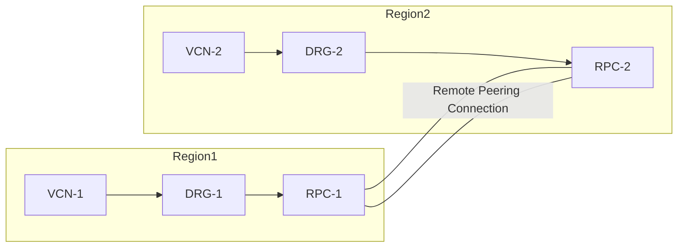

# 🌐 Remote VCN Peering

## 📝 What is Remote VCN Peering?

- **Remote VCN Peering** allows you to connect **VCNs in different regions**.
- Instances in `VCN-1` (Region A) can communicate with instances in `VCN-2` (Region B) **using private IP addresses**.
- Communication is **private** — traffic does **not** traverse the internet.
- Supported in:
  - **Same tenancy**
  - **Different tenancies** (also true for Local Peering)

---

## ⚙️ Components Needed

1. **Two VCNs** with **non-overlapping CIDRs** in different regions  
2. **Dynamic Routing Gateway (DRG)** attached to each VCN  
3. **Remote Peering Connection (RPC)** created on each DRG  
4. **Peering connection** established between the two RPCs  
5. **Route tables** and **security lists** configured properly  

---

## 🏗️ Architecture Overview

### High-Level Flow
- **Region 1** → `VCN-1` → `DRG-1` → `RPC-1`
- **Region 2** → `VCN-2` → `DRG-2` → `RPC-2`
- **RPC-1 ↔ RPC-2** → Establishes remote peering

### Diagram (Conceptual)

---

## 📌 Key Points

- **Remote Peering** connects VCNs across **different regions**.  
- Communication uses **private IPs** and avoids the internet.  
- Works in:
  - **Same tenancy**
  - **Different tenancy** (with upgraded DRGs)
- **Legacy DRGs** → Only same tenancy supported  
- **Upgraded DRGs** → Support **same** and **different tenancy** remote peering  

---

## ✅ Summary

- Remote VCN Peering = Private communication between VCNs in **different regions**.  
- Requires **non-overlapping CIDRs, DRGs, RPCs, route tables, and security lists**.  
- DRG type determines whether **cross-tenancy peering** is supported.  

