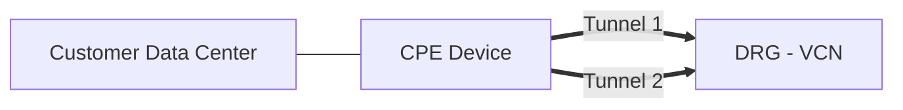

# Lesson: Site-to-Site VPN Connection (Deck Discussion)

## 🔹 What is a Site-to-Site VPN Connection?

- A **Site-to-Site VPN** provides an **IPsec connection** between your **on-premises data center** and an **OCI Virtual Cloud Network (VCN)**.  
- The **IPsec protocol**:
  - Encrypts traffic before sending  
  - Decrypts traffic upon arrival  
- Communication traverses the **public internet**, but remains secure because of encryption.

---

## 🔹 Key Features

1. **Encrypted connection** → Secure traffic between your network and OCI  
2. **High availability** → Each IPsec connection creates **two redundant tunnels**  
3. **Protocol support** → Supports both **IKEv1** and **IKEv2**  
4. **Redundancy** → Two Oracle routers (tunnels) ensure resilience  

---

## 🔹 Architecture Overview

- **CPE (Customer Premises Equipment)**  
  - Your on-premises VPN device (hardware or software)  
  - Verified vendors: *Cisco, Fortinet, Check Point, Juniper, Libreswan*  
  - Each CPE public IP can support **up to 8 IPsec connections**  

- **DRG (Dynamic Routing Gateway)**  
  - Acts as the **VPN headend** on OCI side  
  - Connects to the **VCN**

- **IPsec Connection**  
  - Links **CPE object ↔ DRG**  
  - Results in **two tunnels**  
  - Each tunnel has:
    - **Public IP address**
    - **Pre-shared key**

---

## 🔹 Use Cases

- **Proof of Concept (POC)**  
  - Fast setup, no contract/commitment, no dedicated leased lines  

- **Branch / HQ Connectivity**  
  - Connect headquarters, branches, and private data centers to OCI  
  - Sites can access applications securely  

- **Hybrid / Multi-Cloud**  
  - Connect existing infrastructure to OCI  
  - Extend connectivity between multiple clouds  

- **Redundancy with FastConnect**  
  - Use Site-to-Site VPN as a **backup connection** for Oracle FastConnect  

---

## 🔹 Routing Options

- **Static Routing**  
- **Dynamic Routing (BGP)**  
- **Policy-Based Routing**  

⚡ Note: Routing is configured **per tunnel**, and Oracle recommends using the **same routing type** for both tunnels.

---

## 🔹 Modes of Operation

1. **Transport Mode**  
   - Encrypts only the **payload (data)**  
   - Header remains intact  

2. **Tunnel Mode** ✅ (Supported by Oracle)  
   - Encrypts the **entire packet (header + payload)**  
   - Provides stronger security  

---

## 🔹 NAT Scenario with CPE

- By default, the **IKE identifier** is set to the **public IP** of the CPE.  
- If the CPE is **behind a NAT device**:
  - Configure the IKE identifier to use the **private IP** of the CPE instead.  

---

## ✅ Summary

- Site-to-Site VPN uses **IPsec tunnels** for secure connectivity between **on-premises and OCI**.  
- Each connection = **two redundant tunnels**.  
- Supports **IKEv1 / IKEv2**, **static/dynamic/policy routing**, and **tunnel mode**.  
- CPE device can be hardware/software, with up to **8 IPsec connections per public IP**.  
- Works even if the CPE is **behind NAT** (with IKE identifier adjustment).  
